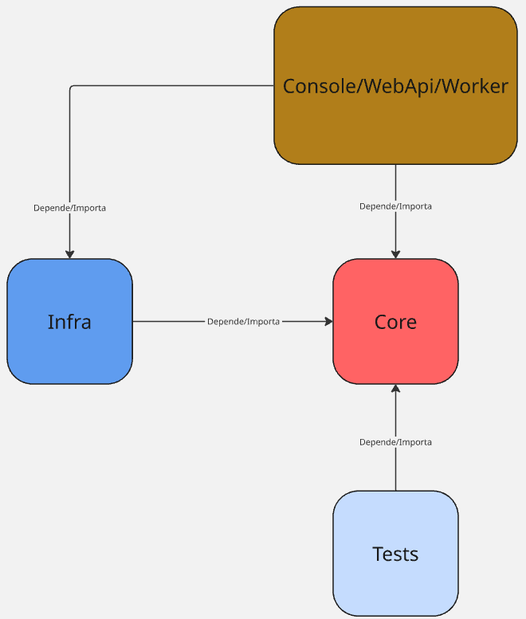

# Fastin

CLI para a inicialização de projetos **.NET 6+**

## API's

A CLI API's para lidar com a incialização de projetos, criação do arquivo Dockerfile e definição de pipelines de CI/CD
utilizando o **GitLab**

- project: Inicialização de projetos
- docker: Geração do arquivo Dockerfile
- gitlab: Geração de pipelines de CI/CD

## Projetos

Tipos de projetos suportados:

- console
- webapi
- worker

Criando um projeto:

```bash
fastin project init-project -p Path/To/Place/Project -n ProjectName -t console|webapi|worker
```

O projeto é gerado seguindo uma estrutura com padrão em camadas:



## Docker

Gera o arquivo Dockerfile utilizando **multi stage build** para reduzir o tamanho da imagem final

```bash
fastin docker init-dockerfile
```

## GitLab

Gera o arquivo .gitlab-ci.yml na raiz do projeto definindo as pipelines de CI/CD

```bash
fastin gitlab init-pipeline -b develop|homolog|main
```

Cada pipeline irá conter dois jobs:

- build: Construção da imagem docker e publicação no **AWS ECR**
- deploy: Criação do serviço serverless no **AWS AppRunner**

É importante executar outro comando para finalizar a etapa:

```bash
fastin gitlab init-dot-ci
```

O comando acima cria a pasta **.ci** junto com os arquivos **library.sh** e **commands.sh** utilizados nas pipelines de **build** e **deploy**
